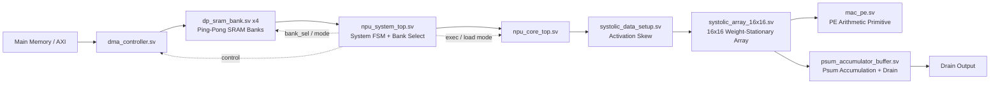

# Architecture Report

## Scope

This document explains the hardware structure, module boundaries, timing assumptions, and architectural invariants of the project.

---

## System Summary

The design is a 16x16 weight-stationary systolic-array NPU.

Top-level dataflow:

1. DMA reads data from AXI memory.
2. Data is staged into ping-pong SRAM banks.
3. The system selects a bank group for compute.
4. Activations are skewed into the systolic array.
5. Weights remain spatially resident in MAC PEs.
6. Partial sums are deskewed and accumulated.
7. Final accumulated values are drained out.

---

## Primary Files

- `rtl/npu_system_top.sv`
  - Top-level integration and system FSM.

- `rtl/npu_core_top.sv`
  - Compute core wrapper.

- `rtl/dma_controller.sv`
  - AXI read DMA path.

- `rtl/dp_sram_bank.sv`
  - Ping-pong bank storage.

- `rtl/systolic_data_setup.sv`
  - Activation skewing.

- `rtl/systolic_array_16x16.sv`
  - 16x16 compute array.

- `rtl/mac_pe.sv`
  - Per-PE arithmetic behavior.

- `rtl/psum_accumulator_buffer.sv`
  - Psum accumulation and drain path.

---

## Module Connectivity

Interpretation:

- `npu_system_top.sv` is the orchestration boundary.
- `npu_core_top.sv` is the compute-path boundary.
- `mac_pe.sv` is conceptually instantiated inside `systolic_array_16x16.sv`, so the diagram shows functional containment rather than a direct top-level routing edge.

---

## Execution Model

### Weight-Stationary Principle

The array uses weight-stationary execution.

- Weights are loaded into the PE structure and remain local during execution.
- Activations move across the array over time.
- Partial sums propagate and are later accumulated in the psum buffer.

This separation is the reason the design distinguishes weight-load and activation-execute phases.

### Timing Model

The documented datapath timing is 31 cycles.

- 15 cycles: activation skew
- 1 cycle: array propagation stage
- 15 cycles: psum deskew

Any analysis that ignores this timing can misclassify correct behavior as a bug.

---

## Module Roles

### `rtl/npu_system_top.sv`

Main responsibilities:

- integrate DMA, SRAM banks, and core
- decode mode and execute the high-level phase flow
- coordinate DMA start, bank selection, and compute launch

This is the first file to read if the question is about system behavior.

### `rtl/npu_core_top.sv`

Main responsibilities:

- connect setup, systolic array, and accumulator
- expose the core-level execution interface

This is the best entry point when the question is specifically about compute datapath composition.

### `rtl/dma_controller.sv`

Main responsibilities:

- issue AXI reads
- track read progress and outstanding transactions
- present staged data to the SRAM path

Architectural invariant:

- beat sizing must remain consistent with `AXI_DATA_WIDTH`

### `rtl/dp_sram_bank.sv`

Main responsibilities:

- store staged data for load/execute alternation
- support ping-pong buffering strategy

### `rtl/systolic_data_setup.sv`

Main responsibilities:

- skew activation inputs for correct diagonal wavefront alignment

### `rtl/systolic_array_16x16.sv`

Main responsibilities:

- implement the main array compute path
- propagate data according to systolic timing rules

### `rtl/mac_pe.sv`

Main responsibilities:

- define local multiply-accumulate behavior per PE

### `rtl/psum_accumulator_buffer.sv`

Main responsibilities:

- accept deskewed psums
- accumulate by address
- handle forwarding for back-to-back same-address writes
- provide drain readout

This block is one of the most behaviorally sensitive modules in the design.

---

## Architecture Invariants

These assumptions should remain true unless the project is intentionally redesigned.

1. Weight-load and activation-execute are logically distinct phases.
2. The array timing assumption remains 31 cycles unless the skew/deskew structure changes.
3. Accumulator same-address forwarding must preserve correctness under consecutive writes.
4. System mode selection must be derived from the NPU mode intent.
5. DMA beat-size logic must scale with interface width rather than fixed magic constants.

If any of these change, this document must be updated.

---

## Architecture Reading Guidance

Use this file to answer questions like:

- What are the top-level blocks?
- How does data move through the design?
- Which module should I inspect first for a given architectural concern?
- Which assumptions are structural versus implementation details?

If the question is instead about tests, logs, or coverage, switch to [docs/verification_report.md](./verification_report.md).
If the question is about failure triage, switch to [docs/debugging_report.md](./debugging_report.md).