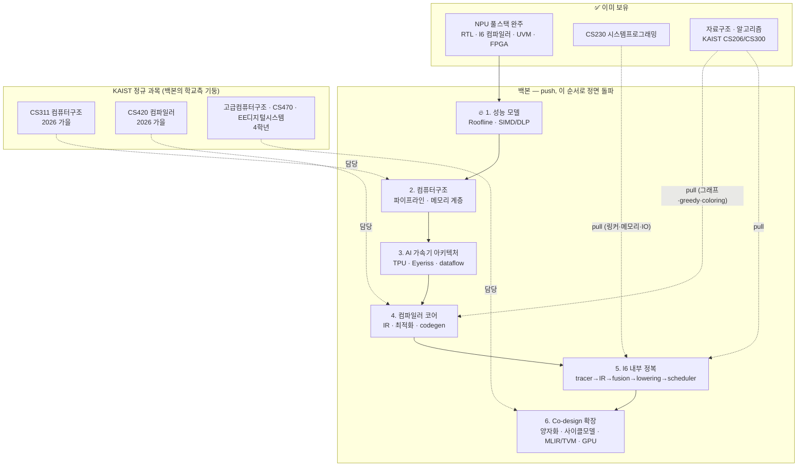

# 🗺️ NPU 풀스택 로드맵 인덱스 — Track A+ (HW를 아는 ML 컴파일러/아키텍트)

> 생성: 2026-07-20 · roadmap.sh 스타일의 **전체 지도** (구조 담당).
> 시간표(주차별 일정)는 [personal_roadmap_2026.md](personal_roadmap_2026.md)가 담당 — 이 문서는 "무엇이 백본이고 무엇이 곁가지인가"를 담당.
> 갱신 규칙: 노드 상태는 [일기](journal/) 기반으로 갱신. 정기 재검토는 8월 말(시간표 확정)·12월 말(Phase 분기 결정).
>
> **시장 캘리브레이션 (2026-07-20):** 채용·학계·실무 5갈래 조사 결과 백본 구조는 유효 확인. 조정 3건 반영 — ① R3 논문은 "LLM decode에서 어디가 무너지나" 렌즈 추가 (2026 최전선은 memory wall·attention), ② 노드 6에 MLIR 명시 (채용 1순위 키워드), ③ 겨울 분기는 Phase 4(CUDA/GPU) 가중 (커널 엔지니어링 수요 급증). 근거는 일기 2026-07-20 결정 4.

---

## 운영 원칙 3줄

1. **백본은 push** — 아래 노드 1→6 순서로 정면 돌파한다. 순서를 건너뛰거나 곁가지로 새지 않는다.
2. **기초는 pull** — 이미 배운 기초(자료구조·알고리즘 등)는 독립 트랙으로 재학습하지 않는다. 백본을 파다가 필요해진 개념만 그 자리에서 10~30분 복습하고 복귀, 일기에 `pull: 개념명` 기록. (2026-07-20 결정)
3. **KAIST 중복은 스킵** — 학교 수업이 다룰/다룬 것은 학교가 책임진다. NPU 시간은 학교가 안 다루는 것에만 쓴다.

## 범례

| 마크 | 의미 |
|---|---|
| ✅ | 완료 / 이미 보유한 자산 |
| 🔥 | **현재 위치** |
| 🟥 | Deep — NPU 고유 가치, 정독+실습 |
| 🟨 | Skim — 학교가 곧 다룸, NPU 연결만 확인 |
| 🟦 | Skip — KAIST 과목이 전담 |
| 🔧 | Pull — 독립 학습 금지, 필요할 때 당겨쓰기 |
| ⬜ | 미래 — 시기 도래 시 활성화 |

---

## 전체 지도

---

## 백본 노드 상세

### 🔥 노드 1 — 성능 모델 (진행 중: R1~R2, 7/20 ~ 8/2)

**왜 백본인가:** 가속기 세계의 공용어. compute-bound/memory-bound 판정 없이는 아키텍처 선택도 컴파일러 최적화도 논할 수 없다. 모든 후속 노드가 이 어휘를 쓴다.

| 항목 | 자료 | 상태 |
|---|---|---|
| Roofline 기본 + 이 NPU 정량화 (Peak 51.2 GOPS / BW 3.2 GB/s / Ridge 16) | Williams CACM'09 → [roofline_summary.md](roofline_summary.md) | ✅ 5/29 |
| Roofline 심화 (Hierarchical, 축 선택) + roofline.py 정독 + 그래프 실습 1 | [브리프 #01](gemini_teaching/brief_01_roofline_deep.md) ← **지금 할 일** | 🔥 R1 |
| SIMD/DLP 이론 | H&P Quantitative 4.1-4.4 | 🟥 R2 |

산출물: `docs/roofline_analysis.md`, SIMD 정리 1쪽.

### 노드 2 — 컴퓨터구조 (R4~R5 skim → CS311 가을 deep)

**왜:** NPU의 손익계산(파이프라인 hazard, 메모리 계층별 에너지 비용)이 전부 여기서 나온다. 단, 교과서 정독은 CS311이 담당 — 방학에는 실습으로 내 칩에 연결만 한다.

| 항목 | 자료 | 상태 |
|---|---|---|
| 파이프라인 skim + **실습 2: systolic_array.sv 31사이클 Vivado 파형 추적** | P&H 4장 + [06_systolic_array.md](02_rtl_core/06_systolic_array.md) | 🟨 R4 |
| 메모리 계층 skim + **실습 3: dp_sram_bank 접근 패턴 분석** | P&H 5장 + [11_dp_sram_bank.md](04_rtl_memory/11_dp_sram_bank.md) | 🟨 R5 |
| ISA·성능 척도, 병렬(6장), 교과서 전체 deep | **CS311이 전담** | 🟦 가을 |

### 노드 3 — AI 가속기 아키텍처 (R3, 최우선 Deep)

**왜:** 트랙의 HW쪽 정체성. 내 16×16 Weight-Stationary 어레이를 산업계 좌표(TPU 256×256 WS, Eyeriss Row-Stationary)에 놓는 작업. 학교는 안 다룬다.

| 항목 | 자료 | 상태 |
|---|---|---|
| TPU v1 논문 + Eyeriss 논문 정독, WS vs RS 비교 1쪽 | Jouppi ISCA'17, Chen ISCA'16 | 🟥 R3 |
| **LLM-decode 렌즈**: 논문마다 "이 설계가 attention/decode 워크로드에서 무너지는 지점" 1문단 | memory wall — attention 사이클 50%+가 메모리 대기 (2026 최전선) | 🟥 R3 |
| dataflow 분류 심화 (WS/OS/RS/NLR), DSA 일반론 | 고급컴퓨터구조 (4학년) + Phase 5 | ⬜ |

### 노드 4 — 컴파일러 코어 (R5 가볍게 → CS420 가을 본편)

**왜:** 트랙의 SW쪽 척추. "성능은 컴파일러가 뽑는다"가 이 트랙의 존재 이유. 이론은 CS420이 담당, NPU 시간은 이론↔l6 연결에 쓴다.

| 항목 | 자료 | 상태 |
|---|---|---|
| 컴파일러 단계 개관 | Dragon Book Ch.1-2 | 🟨 R5 |
| Parsing, semantic, IR, 최적화, codegen 본편 | **CS420이 전담** (Dragon Ch.3~ 진도와 함께) | 🟦 가을 |
| 🔧 pull 예고: DAG·위상정렬·graph coloring이 여기서 되살아남 | CS206/CS300 기억 | 🔧 |

### 노드 5 — l6 내부 정복 (R6 → 가을 9~11월, 유일무이한 차별점)

**왜:** 남의 컴파일러 공부가 아니라 **내가 만든 컴파일러**의 이론적 재해석. 이력서에서 다른 누구도 못 베끼는 부분. CS420 진도와 1:1 동기화.

| 항목 | 자료 | 상태 |
|---|---|---|
| ir.py + tracer.py 정독, IR 구조 다이어그램 | [28_ir.md](08_l6_toolchain/28_ir.md), [29_tracer.md](08_l6_toolchain/29_tracer.md) | 🟥 R6 |
| fusion.py 정독 (9월) → lowering.py + **BatchNorm fusion rule 구현** (10월) → scheduler.py + **새 heuristic 실험** (11월) | [31](08_l6_toolchain/31_fusion.md)·[32](08_l6_toolchain/32_lowering.md)·[33](08_l6_toolchain/33_scheduler.md) | ⬜ 가을 |
| memory_planner / auto_tile / cycle_sim 재해석 | [47](08_l6_toolchain/47_memory_planner.md)·[49](08_l6_toolchain/49_auto_tile.md)·[48](08_l6_toolchain/48_cycle_sim.md) | ⬜ 가을~겨울 |
| **l6에 attention 워크로드 추가** — LLM-시대 차별점 프로젝트 (BatchNorm fusion보다 강한 한 방) | NPU 고유 + 2026 시장 조정 | ⬜ 겨울+ |

산출물: IR 다이어그램, fusion rule PR, scheduling heuristic PR, `phase1_completion.md`.

### 노드 6 — Co-design 확장 (겨울방학 ~ 4학년)

**왜:** HW+SW 두 멘탈 모델을 동시에 쥐는 것이 트랙 A+의 최종 형태이자 AI 대체 저항성의 원천.

| 항목 | 자료 | 상태 |
|---|---|---|
| 겨울 분기: **Phase 4(CUDA/GPU) 우선 권고** — 커널 엔지니어링 수요·Triton·GPU MODE (2026-07 시장 분석). Phase 2(RTL 검증)는 후순위 | 12월 말 검토 확정, [GPU MODE lectures](https://github.com/gpu-mode/lectures) + PMPP 5판(도서관) | ⬜ 2027-01 |
| **MLIR** — Toy Tutorial + dialect 개념 (채용 공고 1순위 키워드) | [mlir.llvm.org Toy Tutorial](https://mlir.llvm.org/docs/Tutorials/Toy/) | ⬜ 겨울 (CS420 직후가 최적) |
| 양자화 심화 (INT8 패킹 → AI 2배 이슈의 연장, 실무는 FP8/FP4·AWQ/GPTQ) | [46_quantize.md](08_l6_toolchain/46_quantize.md), Jacob CVPR'18 | ⬜ |
| MLC/TVM 생태계, ML컴파일러 세미나 청강 | 대학원 세미나 | ⬜ 4학년 |
| CS470(ML), EE 디지털시스템설계, 고급컴퓨터구조 | KAIST | ⬜ 4학년 |

---

## 🔧 Pull 레일 — 독립 학습 금지 목록

아래 기초는 **절대 독립 트랙으로 다시 배우지 않는다.** 백본에서 만나는 순간 그 개념만 복습한다.

| 기초 | 이미 배운 곳 | 백본에서 다시 만나는 곳 |
|---|---|---|
| 자료구조·알고리즘 | CS206/CS300 | ir.py(DAG·위상정렬) · fusion.py(그래프 패턴 매칭) · memory_planner.py(graph coloring, Chaitin'82) · scheduler.py(greedy/list scheduling) · auto_tile.py(탐색공간 순회) |
| 시스템 프로그래밍 | CS230 | replay_bridge · host 런타임 · DMA/메모리맵 |
| 선형대수·확률 | 수학 과목 | GEMM 타일링 수식 · quantize 오차 분석 |
| 디지털 논리·RTL | NPU 프로젝트로 체득 | Phase 2 재진입 시 · EE 디지털시스템설계 |
| OS | CS330(수강 시) | 런타임/드라이버/스케줄링 |

**pull 프로토콜:** 막힘 → 해당 개념만 10~30분 복습 → 백본 복귀 → 일기에 `pull: 개념명 (어디서 필요했나)` 한 줄.

---

## 현재 위치와 다음 액션

- **현재 위치:** 🔥 노드 1 (R1 주차, 2026-07-20~26)
- **다음 액션 단 하나:** [브리프 #01](gemini_teaching/brief_01_roofline_deep.md)의 `=== PROMPT ===` 블록을 Gemini에 붙여넣고 세션 시작 → 끝나면 요약을 Claude에 전달
